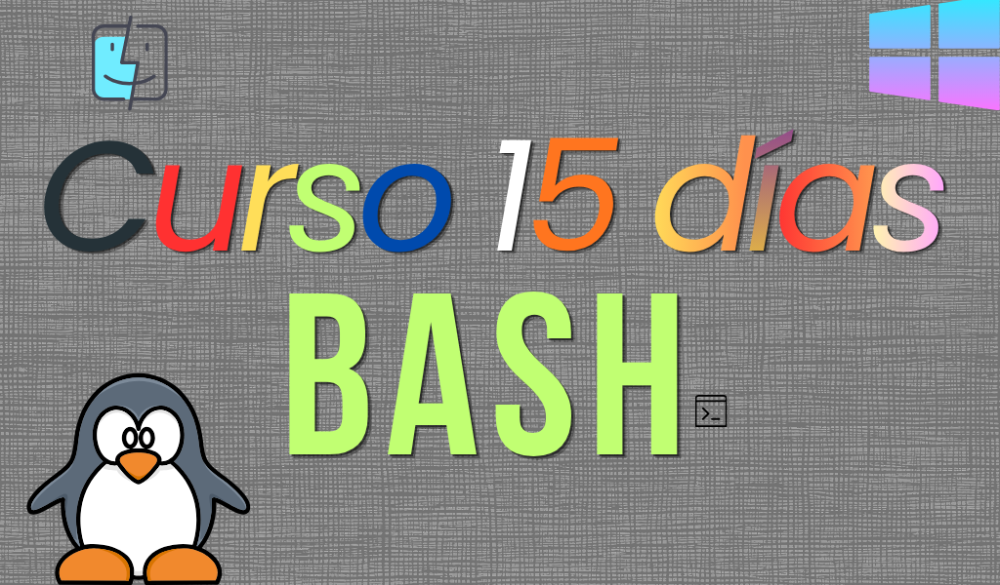

# 🎓 Aprende Bash en 15 Días — Guía Completa de Scripting y Terminal

¡Bienvenido/a a **Aprende Bash en 15 Días**! Esta es una guía paso a paso, práctica y diseñada especialmente para llevarte desde el desconocimiento absoluto de la línea de comandos hasta un nivel avanzado en el desarrollo de scripts de automatización, administración de sistemas y herramientas Unix.

Inspirado en el formato de _30 Days of Python_, este manual incluye teoría detallada, ejemplos del mundo real listos para ejecutar y ejercicios prácticos diarios con soluciones integradas.

---

## 📚 Índice del Curso

| Día | Tema                                                                                                           | Descripción Corta                                                                 |     Nivel     |
| :-: | :------------------------------------------------------------------------------------------------------------- | :-------------------------------------------------------------------------------- | :-----------: |
| 01  | [Día 1: Introducción a Bash y la CLI](file:///x:/project1/curso-bash/01-fundamentos/dia-01/README.md)          | Primeros pasos en la terminal, comandos esenciales de navegación y ayuda.         |   🟢 Básico   |
| 02  | [Día 2: Manipulación y Visualización](file:///x:/project1/curso-bash/01-fundamentos/dia-02/README.md)          | Leer, copiar, mover, renombrar y eliminar archivos y directorios. Enlaces.        |   🟢 Básico   |
| 03  | [Día 3: Permisos y Usuarios](file:///x:/project1/curso-bash/01-fundamentos/dia-03/README.md)                   | Permisos de lectura, escritura y ejecución (`chmod`, `chown`, `sudo`).            |   🟢 Básico   |
| 04  | [Día 4: Entrada/Salida, Redirecciones y Pipes](file:///x:/project1/curso-bash/01-fundamentos/dia-04/README.md) | Redireccionar flujos de datos (`>`, `>>`, `<`), tuberías (`\|`) y `tee`.          | 🟡 Intermedio |
| 05  | [Día 5: Procesamiento de Texto Básico](file:///x:/project1/curso-bash/01-fundamentos/dia-05/README.md)         | Filtrar e investigar texto usando `grep`, `wc`, `sort`, `uniq`, `cut` y `tr`.     | 🟡 Intermedio |
| 06  | [Día 6: Variables y Entorno](file:///x:/project1/curso-bash/02-scripting/dia-06/README.md)                     | Definir variables, variables del sistema, exportar y sustitución de comandos.     | 🟡 Intermedio |
| 07  | [Día 7: Aritmética y Comparaciones](file:///x:/project1/curso-bash/02-scripting/dia-07/README.md)              | Cálculos matemáticos y comprobación de estados de archivos, números y strings.    | 🟡 Intermedio |
| 08  | [Día 8: Estructuras Condicionales](file:///x:/project1/curso-bash/02-scripting/dia-08/README.md)               | Tomar decisiones con `if`, `elif`, `else` y menús con `case`.                     | 🟡 Intermedio |
| 09  | [Día 9: Bucles e Iteraciones](file:///x:/project1/curso-bash/02-scripting/dia-09/README.md)                    | Ciclos `for`, `while` y `until`. Lectura automatizada de archivos de texto.       | 🟡 Intermedio |
| 10  | [Día 10: Funciones y Modularidad](file:///x:/project1/curso-bash/02-scripting/dia-10/README.md)                | Reutilizar código, parámetros posicionales, código de retorno y `source`.         | 🟡 Intermedio |
| 11  | [Día 11: Editores de Flujo (sed y awk)](file:///x:/project1/curso-bash/03-avanzado/dia-11/README.md)           | Reemplazos masivos con `sed` y procesamiento de reportes de texto con `awk`.      |  🔴 Avanzado  |
| 12  | [Día 12: Gestión de Procesos y Señales](file:///x:/project1/curso-bash/03-avanzado/dia-12/README.md)           | Tareas en background (`bg`, `fg`), monitoreo, comando `kill` y captura (`trap`).  |  🔴 Avanzado  |
| 13  | [Día 13: Búsquedas, Compresión y Red](file:///x:/project1/curso-bash/03-avanzado/dia-13/README.md)             | Buscar archivos con `find`, comprimir con `tar`/`zip` y redes con `curl`/`rsync`. |  🔴 Avanzado  |
| 14  | [Día 14: Depuración, Seguridad y Robustez](file:///x:/project1/curso-bash/03-avanzado/dia-14/README.md)        | Modo seguro `set -euo pipefail`, depuración con `set -x` y `ShellCheck`.          |  🔴 Avanzado  |
| 15  | [Día 15: Automatización y Proyecto Final](file:///x:/project1/curso-bash/03-avanzado/dia-15/README.md)         | Tareas automáticas con `cron` y desarrollo de un script de respaldo avanzado.     |  🔴 Avanzado  |

---

## 🛠️ ¿Qué es Bash y por qué aprenderlo?

**Bash** (_Bourne Again SHell_) es el intérprete de comandos por defecto en la inmensa mayoría de distribuciones GNU/Linux, macOS (donde también convive con Zsh) y servidores de la nube.

Aprender Bash te permitirá:

- **Automatizar tareas repetitivas** que normalmente te tomarían horas.
- **Administrar servidores remotos** con total fluidez.
- **Crear flujos de despliegue (CI/CD)** para tus aplicaciones web o móviles.
- **Manipular volúmenes masivos de datos** y logs en segundos sin herramientas pesadas.

---

## 💻 Requisitos y Configuración de Entorno

No necesitas un ordenador de alta gama ni instalar un sistema operativo nuevo. Aquí te explicamos cómo acceder a una consola Bash desde tu sistema actual:

### 🪟 Windows

1.  **WSL (Windows Subsystem for Linux)** _(Recomendado)_: Te permite correr una terminal Ubuntu real dentro de Windows. Abre PowerShell y escribe `wsl --install`. Reinicia y listo.
2.  **Git Bash**: Si instalaste Git, ya tienes una terminal de comandos Bash emulada instalada en tu sistema.
3.  **Docker**: Puedes arrancar un contenedor ligero: `docker run -it ubuntu bash`.

### 🍎 macOS

- Abre la aplicación **Terminal** (presiona `Cmd + Espacio` y escribe "Terminal").
- _Nota_: macOS utiliza `Zsh` por defecto en versiones recientes. Son 99% compatibles para este curso, pero si quieres usar Bash puro, puedes escribir `bash` en tu terminal para cambiar de intérprete.

### 🐧 Linux

- ¡Ya lo tienes todo! Simplemente abre tu aplicación de terminal favorita (Gnome Terminal, Konsole, Alacritty, etc.).

---

## 🎓 Metodología de Aprendizaje

Cada día de este curso está estructurado con el mismo patrón para garantizar un aprendizaje efectivo:

1.  **Explicación Conceptual**: Teoría clara, directa y libre de relleno innecesario.
2.  **Sintaxis y Comandos**: Tablas de comandos explicativas paso a paso.
3.  **Ejemplos Prácticos**: Fragmentos de código comentados que puedes copiar, pegar y ejecutar.
4.  **Ejercicios de Práctica**: Retos ordenados por dificultad (Fácil, Medio y Difícil) para afianzar tus conocimientos. Las soluciones se encuentran colapsadas al final de cada documento para que puedas autoevaluarte.

---

## 👥 Contribuciones y Soporte

Si encuentras algún error tipográfico, quieres sugerir mejoras en las explicaciones o añadir nuevos ejercicios, ¡no dudes en abrir un _Pull Request_ o una _Issue_!

¡Comienza hoy mismo haciendo clic en el **[Día 1: Introducción a Bash y la CLI](file:///x:/project1/curso-bash/dias/01_introduccion_a_bash/README.md)**!

> [!WARNING]
>
> ### NO OLVIDES VISITAR MI WEB, Pulsando [AQUI](https://www.tecxart.es)

## 💰 ¿Puedes ayudarme a crecer?

#### No olvides que siempre puedes ayudarme con un café, o una simple ⭐ en el repositorio.

<h1 align="center">
   
</h1>

